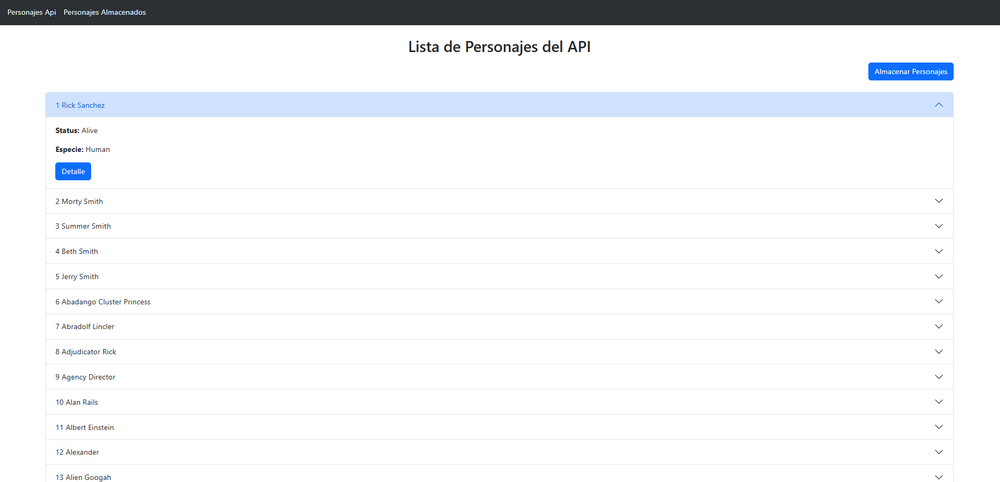
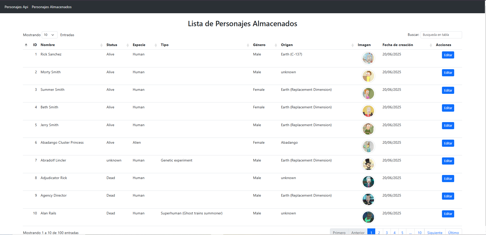

# Proyecto consumo de api 

## Requisitos

```bash

Laravel v11.45.1 (PHP v8.3.20)

```

## Instalación

```bash

# 1. Clonar el repositorio
git https://github.com/BrayanZipa/consumo_api.git

# 2. Instalar dependencias PHP
composer install

# 3. Configurar el entorno
cp .env.example .env
php artisan key:generate
Crear base de datos y configurar credenciales

# 4. Ejecutar migraciones
php artisan migrate
o alternativamente ejecutar el script personajes.sql ubicado en la carpeta database (ya contiene la creación de la base de datos)

# 5. Iniciar el servidor backend
php artisan serve

```

## Proyecto



